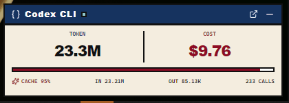

# QuotaLoom

<p align="center">
  
</p>

<p align="center">
  <a href="README.md">简体中文</a> · English
</p>

<p align="center">
  <a href="https://github.com/EricsmOOn/quota-loom/actions/workflows/ci.yml"></a>
  <a href="https://github.com/EricsmOOn/quota-loom/actions/workflows/release.yml"></a>
  <a href="https://github.com/EricsmOOn/quota-loom/releases/latest"></a>
  <a href="LICENSE"></a>
</p>

QuotaLoom is a local-first desktop usage dashboard for Claude Code, Codex CLI, and ChatGPT Codex. It incrementally parses local JSONL session files and presents the results in an always-available floating panel and a full dashboard.

> [!IMPORTANT]
> This is an unofficial community project. It is not affiliated with or endorsed by OpenAI, Anthropic, or their affiliates. Codex, ChatGPT, Claude, and related names belong to their respective owners.

## Features

- Token usage for today, the last 24 hours, 7 days, or 30 days.
- Separate fresh input, cached input, and model output totals.
- Call, session, cache-hit, and model distribution statistics.
- Weekly allowance usage and reset time for ChatGPT Codex accounts.
- Estimated costs from the current model catalog with custom multipliers.
- Incremental parsing that handles appended, truncated, and actively written logs.
- A floating panel, full dashboard, and system tray integration.

Cost figures are estimates and are not provider invoices.

## Data sources

The selected data directory is detected from its structure:

| Source        | Session directories               |
| ------------- | --------------------------------- |
| Claude Code   | `projects/`                       |
| Codex CLI     | `sessions/`, `archived_sessions/` |
| ChatGPT Codex | `sessions/`, `archived_sessions/` |

The app prefers `$CODEX_HOME` and otherwise falls back to `~/.codex`. Claude Code users can select the relevant `~/.claude` directory in the dashboard.

## Privacy

- Session logs are read locally. Prompts and responses are not uploaded.
- The local SQLite database stores only the session identifiers, timestamps, models, token totals, parsing cursors, and source paths needed for statistics.
- At startup and when prices are refreshed manually, the app sends an HTTPS GET request to `https://models.dev/api.json`. No session data is included.
- To display weekly ChatGPT Codex allowance, the app starts the local `codex app-server` and requests account rate limits. Codex CLI may contact the provider using its existing login; this app does not read or store those credentials.
- The project contains no telemetry or behavioral analytics.

See [Privacy and data handling](docs/PRIVACY.md) for details. Never attach raw session JSONL files, the application database, or screenshots containing private paths to an issue.

## Installation

Once stable builds are available, download the appropriate installer from the repository's **Releases** page. Release targets are:

- macOS on Apple Silicon and Intel
- Windows x86-64
- Linux x86-64 AppImage, Deb, or RPM, depending on the assets in each release

## Development

Requirements:

- Node.js 24
- npm 11 or newer
- Rust 1.96
- [Tauri 2 platform prerequisites](https://v2.tauri.app/start/prerequisites/)

Install dependencies and run the browser demo:

```bash
npm ci
npm run dev
```

Run the desktop app:

```bash
npm run tauri dev
```

On Debian or Ubuntu, install the desktop build dependencies with:

```bash
sudo apt-get update
sudo apt-get install -y libwebkit2gtk-4.1-dev \
  libayatana-appindicator3-dev librsvg2-dev patchelf \
  pkg-config libssl-dev
```

## Quality checks

```bash
npm run check
npm audit --audit-level=high

cd src-tauri
cargo fmt --check
cargo clippy --locked --no-default-features --all-targets -- -D warnings
cargo test --locked --no-default-features
```

With the platform-specific Tauri dependencies installed, also run:

```bash
cd src-tauri
cargo check --locked --all-targets --all-features
```

## Project layout

```text
src/                    React UI and floating panel
src-tauri/src/core/     Parsing, SQLite, and pricing core
src-tauri/src/desktop.rs
                        Tauri windows, tray, and commands
docs/                   Architecture, privacy, and release docs
.github/                CI, release, issue, and PR configuration
```

See [Architecture](docs/ARCHITECTURE.md) for more detail.

## Contributing

Read [CONTRIBUTING.md](CONTRIBUTING.md) and [CODE_OF_CONDUCT.md](CODE_OF_CONDUCT.md) before contributing. Report vulnerabilities privately as described in [SECURITY.md](SECURITY.md).

## License

Licensed under the [MIT License](LICENSE).
